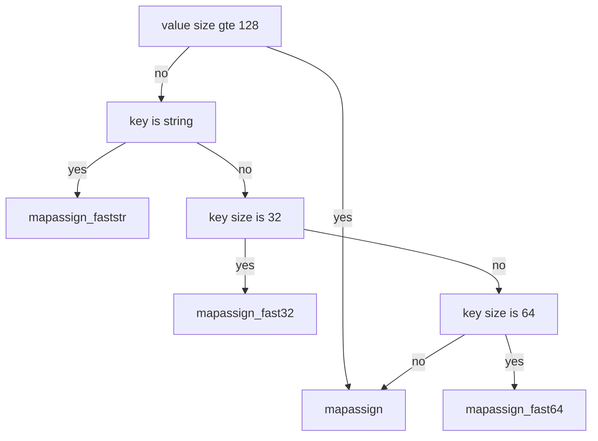

# map

```
          ┌─────────────┐                                                                                                                                                                                                           
          │    hmap     │                                                                                                                                                                                                           
          ├─────────────┴──────────────────┐           ┌───────────────┐                                        ┌─────────┐                               ┌─────────┐                                                               
          │           count int            │           │               │                     ┌─────────────────▶│  bmap   │                          ┌───▶│  bmap   │                                                               
          │                                │           │               ▼                     │                  ├─────────┴─────────────────────┐    │    ├─────────┴─────────────────────┐                                         
          ├────────────────────────────────┤           │    ────────┬─────┐                  │                  │   tophash [bucketCnt]uint8    │    │    │   tophash [bucketCnt]uint8    │                                         
          │          flags uint8           │           │       ▲    │  0  │                  │                  │                               │    │    │                               │                                         
          │                                │           │       │    │     │──────────────────┘                  ├──────────┬────────────────────┤    │    ├──────────┬────────────────────┤                                         
          ├────────────────────────────────┤           │       │    ├─────┤                                     │   keys   │                    │    │    │   keys   │                    │                                         
          │            B uint8             │           │       │    │  1  │                                     ├───┬───┬──┴┬───┬───┬───┬───┬───┤    │    ├───┬───┬──┴┬───┬───┬───┬───┬───┤                                         
          │                                │           │       │    │     │──────────────────┐                  │ 0 │ 1 │ 2 │ 3 │ 4 │ 5 │ 6 │ 7 │    │    │ 0 │ 1 │ 2 │ 3 │ 4 │ 5 │ 6 │ 7 │                                         
          ├────────────────────────────────┤           │       │    ├─────┤                  │                  ├───┴───┴──┬┴───┴───┴───┴───┴───┤    │    ├───┴───┴──┬┴───┴───┴───┴───┴───┤                                         
          │        noverflow uint16        │           │       │    │  2  │                  │                  │  values  │                    │    │    │  values  │                    │                                         
          │                                │           │       │    │     │                  │                  ├───┬───┬──┴┬───┬───┬───┬───┬───┤    │    ├───┬───┬──┴┬───┬───┬───┬───┬───┤                                         
          ├────────────────────────────────┤           │       │    ├─────┤                  │                  │ 0 │ 1 │ 2 │ 3 │ 4 │ 5 │ 6 │ 7 │    │    │ 0 │ 1 │ 2 │ 3 │ 4 │ 5 │ 6 │ 7 │                                         
          │          hash0 uint32          │           │       │    │  3  │                  │                  ├───┴───┴───┴───┴───┴───┴───┴───┤    │    ├───┴───┴───┴───┴───┴───┴───┴───┤                                         
          │                                │           │       │    │     │                  │                  │        overflow *bmap         │    │    │        overflow *bmap         │                                         
          ├────────────────────────────────┤           │       │    ├─────┤                  │                  │                               │────┘    │                               │                                         
          │     buckets unsafe.Pointer     │           │       │    │  4  │                  │                  ├─────────┬─────────────────────┘         └───────────────────────────────┘                                         
          │                                │───────────┘       │    │     │                  └─────────────────▶│  bmap   │                                                                                                         
          ├────────────────────────────────┤                        ├─────┤                                     ├─────────┴─────────────────────┐                                                                                   
          │   oldbuckets unsafe.Pointer    │                        │  5  │                                     │   tophash [bucketCnt]uint8    │                                                                                   
          │                                │                        │     │                                     │                               │                                                                                   
          ├────────────────────────────────┤         size = 2 ^ B   ├─────┤                                     ├──────────┬────────────────────┤                                                                                   
          │       nevacuate uintptr        │                        │  6  │                                     │   keys   │                    │                                                                                   
          │                                │                        │     │                                     ├───┬───┬──┴┬───┬───┬───┬───┬───┤                                                                                   
          ├────────────────────────────────┤                   │    ├─────┤                                     │ 0 │ 1 │ 2 │ 3 │ 4 │ 5 │ 6 │ 7 │                                                                                   
          │        extra *mapextra         │                   │    │  7  │                                     ├───┴───┴──┬┴───┴───┴───┴───┴───┤                                                                                   
       ┌──│                                │                   │    │     │                                     │  values  │                    │                                                                                   
       │  └────────────────────────────────┘                   │    └─────┘                                     ├───┬───┬──┴┬───┬───┬───┬───┬───┤                                                                                   
       │                                                       │      ....                                      │ 0 │ 1 │ 2 │ 3 │ 4 │ 5 │ 6 │ 7 │                                                                                   
       │                                                       │                                                ├───┴───┴───┴───┴───┴───┴───┴───┤                                                                                   
       │                                                       │    ┌─────┐                                     │        overflow *bmap         │                                                                                   
       │                                                       │    │ 61  │                                     │                               │                                                                                   
       │                                                       │    │     │                                     └───────────────────────────────┘                                                                                   
       ▼                                                       │    ├─────┤                                               ............                                                                                              
┌─────────────┐                                                │    │ 62  │                                     ┌─────────┐                               ┌─────────┐                              ┌─────────┐                      
│  mapextra   │                                                │    │     │────────────────────────────────────▶│  bmap   │                          ┌───▶│  bmap   │                         ┌───▶│  bmap   │                      
├─────────────┴──────────────┐                                 │    ├─────┤                                     ├─────────┴─────────────────────┐    │    ├─────────┴─────────────────────┐   │    ├─────────┴─────────────────────┐
│     overflow *[]*bmap      │                                 │    │ 63  │                                     │   tophash [bucketCnt]uint8    │    │    │   tophash [bucketCnt]uint8    │   │    │   tophash [bucketCnt]uint8    │
│                            │                                 ▼    │     │──────────────────┐                  │                               │    │    │                               │   │    │                               │
├────────────────────────────┤                              ────────┴─────┘                  │                  ├──────────┬────────────────────┤    │    ├──────────┬────────────────────┤   │    ├──────────┬────────────────────┤
│    oldoverflow *[]*bmap    │                                                               │                  │   keys   │                    │    │    │   keys   │                    │   │    │   keys   │                    │
│                            │                                                               │                  ├───┬───┬──┴┬───┬───┬───┬───┬───┤    │    ├───┬───┬──┴┬───┬───┬───┬───┬───┤   │    ├───┬───┬──┴┬───┬───┬───┬───┬───┤
├────────────────────────────┤                                                               │                  │ 0 │ 1 │ 2 │ 3 │ 4 │ 5 │ 6 │ 7 │    │    │ 0 │ 1 │ 2 │ 3 │ 4 │ 5 │ 6 │ 7 │   │    │ 0 │ 1 │ 2 │ 3 │ 4 │ 5 │ 6 │ 7 │
│     nextoverflow *bmap     │                                                               │                  ├───┴───┴──┬┴───┴───┴───┴───┴───┤    │    ├───┴───┴──┬┴───┴───┴───┴───┴───┤   │    ├───┴───┴──┬┴───┴───┴───┴───┴───┤
│                            │                                                               │                  │  values  │                    │    │    │  values  │                    │   │    │  values  │                    │
└────────────────────────────┘                                                               │                  ├───┬───┬──┴┬───┬───┬───┬───┬───┤    │    ├───┬───┬──┴┬───┬───┬───┬───┬───┤   │    ├───┬───┬──┴┬───┬───┬───┬───┬───┤
                                                                                             │                  │ 0 │ 1 │ 2 │ 3 │ 4 │ 5 │ 6 │ 7 │    │    │ 0 │ 1 │ 2 │ 3 │ 4 │ 5 │ 6 │ 7 │   │    │ 0 │ 1 │ 2 │ 3 │ 4 │ 5 │ 6 │ 7 │
                                                                                             │                  ├───┴───┴───┴───┴───┴───┴───┴───┤    │    ├───┴───┴───┴───┴───┴───┴───┴───┤   │    ├───┴───┴───┴───┴───┴───┴───┴───┤
                                                                                             │                  │        overflow *bmap         │    │    │        overflow *bmap         │   │    │        overflow *bmap         │
                                                                                             │                  │                               │────┘    │                               │───┘    │                               │
                                                                                             │                  ├─────────┬─────────────────────┘         └───────────────────────────────┘        └───────────────────────────────┘
                                                                                             └─────────────────▶│  bmap   │                                                                                                         
                                                                                                                ├─────────┴─────────────────────┐                                                                                   
                                                                                                                │   tophash [bucketCnt]uint8    │                                                                                   
                                                                                                                │                               │                                                                                   
                                                                                                                ├──────────┬────────────────────┤                                                                                   
                                                                                                                │   keys   │                    │                                                                                   
                                                                                                                ├───┬───┬──┴┬───┬───┬───┬───┬───┤                                                                                   
                                                                                                                │ 0 │ 1 │ 2 │ 3 │ 4 │ 5 │ 6 │ 7 │                                                                                   
                                                                                                                ├───┴───┴──┬┴───┴───┴───┴───┴───┤                                                                                   
                                                                                                                │  values  │                    │                                                                                   
                                                                                                                ├───┬───┬──┴┬───┬───┬───┬───┬───┤                                                                                   
                                                                                                                │ 0 │ 1 │ 2 │ 3 │ 4 │ 5 │ 6 │ 7 │                                                                                   
                                                                                                                ├───┴───┴───┴───┴───┴───┴───┴───┤                                                                                   
                                                                                                                │        overflow *bmap         │                                                                                   
                                                                                                                │                               │                                                                                   
                                                                                                                └───────────────────────────────┘                                                                                   
```

## 数据结构

```go
const (
    // 一个 bucket 最多能放的元素数
    bucketCntBits = 3
    bucketCnt     = 1 << bucketCntBits

    // load factor = 13/2
    loadFactorNum = 13
    loadFactorDen = 2

    // 超过这两个 size 的对应对象，会被转为指针
    maxKeySize   = 128
    maxValueSize = 128

    // data offset should be the size of the bmap struct, but needs to be
    // aligned correctly. For amd64p32 this means 64-bit alignment
    // even though pointers are 32 bit.
    dataOffset = unsafe.Offsetof(struct {
        b bmap
        v int64
    }{}.v)

    // tophash 除了放正常的高 8 位的 hash 值
    // 还会在空闲、迁移时存储一些特征的状态值
    // 所以合法的 tophash(指计算出来的那种)，最小也应该是 4
    // 小于 4 的表示的都是我们自己定义的状态值
    empty          = 0 // cell is empty
    evacuatedEmpty = 1 // cell is empty, bucket is evacuated.
    evacuatedX     = 2 // key/value is valid.  Entry has been evacuated to first half of larger table.
    evacuatedY     = 3 // same as above, but evacuated to second half of larger table.
    minTopHash     = 4 // minimum tophash for a normal filled cell.

    // flags
    iterator     = 1 // there may be an iterator using buckets
    oldIterator  = 2 // there may be an iterator using oldbuckets
    hashWriting  = 4 // a goroutine is writing to the map
    sameSizeGrow = 8 // the current map growth is to a new map of the same size

    // sentinel bucket ID for iterator checks
    noCheck = 1<<(8*sys.PtrSize) - 1
)

// A header for a Go map.
type hmap struct {
    count     int // map 中的元素个数，必须放在 struct 的第一个位置，因为 内置的 len 函数会从这里读取
    flags     uint8
    B         uint8  // log_2 of # of buckets (最多可以放 loadFactor * 2^B 个元素，再多就要 hashGrow 了)
    noverflow uint16 // overflow 的 bucket 的近似数
    hash0     uint32 // hash seed

    buckets    unsafe.Pointer // 2^B 大小的数组，如果 count == 0 的话，可能是 nil
    oldbuckets unsafe.Pointer // 一半大小的之前的 bucket 数组，只有在 growing 过程中是非 nil
    nevacuate  uintptr        // progress counter for evacuation (buckets less than this have been evacuated)

    extra *mapextra // 当 key 和 value 都可以 inline 的时候，就会用这个字段
}

type mapextra struct {
    // 如果 key 和 value 都不包含指针，并且可以被 inline(<=128 字节)
    // 使用 extra 来存储 overflow bucket，这样可以避免 GC 扫描整个 map
    // 然而 bmap.overflow 也是个指针。这时候我们只能把这些 overflow 的指针
    // 都放在 hmap.extra.overflow 和 hmap.extra.oldoverflow 中了
    // overflow 包含的是 hmap.buckets 的 overflow 的 bucket
    // oldoverflow 包含扩容时的 hmap.oldbuckets 的 overflow 的 bucket
    overflow    *[]*bmap
    oldoverflow *[]*bmap

    // 指向空闲的 overflow bucket 的指针
    nextOverflow *bmap
}

// bucket 本体
type bmap struct {
    // tophash 是 hash 值的高 8 位
    tophash [bucketCnt]uint8
    // keys
    // values
    // overflow pointer
}
```

## 初始化

形如:

```go
make(map[k]v, hint)
```

的代码，在 hint <= 8(bucketSize) 时，会调用 makemap_small 来进行初始化，如果 hint > 8，则调用 makemap。

```go
make(map[k]v) // 测试时，把这个作为一个全局变量 var a = make(map[int]int)
```

不提供 hint 的代码，编译器始终会调用 makemap_small 来初始化。

```go
// make(map[k]v, hint)
// 如果编译器认为 map 和第一个 bucket 可以直接创建在栈上，h 和 bucket 可能都是非空
// h != nil，可以直接在 h 内创建 map
// 如果 h.buckets != nil，其指向的 bucket 可以作为第一个 bucket 来使用
func makemap(t *maptype, hint int, h *hmap) *hmap {
    // 在 64 位系统上 hmap 结构体大小为 48 字节
    // 32 位系统上是 28 字节
    if sz := unsafe.Sizeof(hmap{}); sz != 8+5*sys.PtrSize {
        println("runtime: sizeof(hmap) =", sz, ", t.hmap.size =", t.hmap.size)
        throw("bad hmap size")
    }

    if hint < 0 || hint > int(maxSliceCap(t.bucket.size)) {
        hint = 0
    }

    // 初始化 hmap
    if h == nil {
        h = (*hmap)(newobject(t.hmap))
    }
    h.hash0 = fastrand()

    // 按照提供的元素个数，找一个可以放得下这么多元素的 B 值
    B := uint8(0)
    for overLoadFactor(hint, B) {
        B++
    }
    h.B = B

    // 分配初始的 hash table
    // 如果 B == 0，buckets 字段会由 mapassign 来 lazily 分配
    // 因为如果 hint 很大的话，对这部分内存归零会花比较长时间
    if h.B != 0 {
        var nextOverflow *bmap
        h.buckets, nextOverflow = makeBucketArray(t, h.B)
        if nextOverflow != nil {
            h.extra = new(mapextra)
            h.extra.nextOverflow = nextOverflow
        }
    }

    return h
}
```

当然，实际选用哪个函数不只要看 hint，还要看逃逸分析结果，比如下面这段代码，在生成的汇编中，你是找不到 makemap 的踪影的：

```go
package main

func main() {
	var m = make(map[int]int, 4)
	m[1] = 1
}
```

编译器确定 make map 函数的位置在：cmd/compile/internal/gc/walk.go:1192:

```go
	case OMAKEMAP:
		t := n.Type
		hmapType := hmap(t)
		hint := n.Left
```

有兴趣的同学可以自行查看~

## 元素访问

主要是对 key 进行 hash 计算，计算后用 low bits 和高 8 位 hash 找到对应的位置:

```
   ┌─────────────┬─────────────────────────────────────────────────────┬─────────────┐                          
   │  10010111   │ 000011110110110010001111001010100010010110010101010 │    01010    │                          
   └─────────────┴─────────────────────────────────────────────────────┴─────────────┘                          
          ▲                                                                   ▲                                 
          │                                                                   │                                 
          │                                                                   │                   B = 5         
          │                                                                   │             bucketMask = 11111  
          │                                                                   │                                 
          │                                                            ┌─────────────┬───┬─────────────┐        
          │                                                            │  low bits   │ & │ bucketMask  │        
          │                                                            ├─────────────┴───┴─────────────┤        
          │                                                            │         01010 & 11111         │        
          │                                                            └───────────────────────────────┘        
          │                                                                            │                        
          │                                                                            │                        
          │                                                                            │                        
          │                                                                            ▼                        
          │                                                                  ┌───────────────────┐              
          │                                                                  │    01010 = 12     │              
          │                                                                  └───────────────────┘              
          │                                                                            │                        
          │                                                                            │                        
          │                                                                            │                        
          │                                                                            │                        
          │                                                                            │                        
   ┌─────────────┐                                                                     │                        
   │   tophash   │                                                                     │                        
   └─────────────┘                       ┌─────────┐                                   │                        
          │                              │ buckets │                                   ▼                        
          │                              ├───┬───┬─┴─┬───┬───┬───┬───┬───┬───┬───┬───┬───┐    ┌───┬───┬───┐     
          │                              │ 0 │ 1 │ 2 │ 3 │ 4 │ 5 │ 6 │ 7 │ 8 │ 9 │10 │11 │ ...│29 │30 │31 │     
          │                              └───┴───┴───┴───┴───┴───┴───┴───┴───┴───┴───┴───┘    └───┴───┴───┘     
          ▼                                                                            │                        
┌──────────────────┐                                                                   │                        
│  10010111 = 151  │─────────────┐                                                     │                        
└──────────────────┘             │                                                     │                        
                                 │                                                     │                        
                                 │                                                     │                        
                                 │                             ┌───────────────────────┘                        
                                 │                             │                                                
                                 │                             │                                                
                                 │                             │                                                
                                 │                             │                                                
                                 │                             │                                                
                                 │                             │                                                
                                 │                             ▼                                                
                                 │                      ┌─────────────┐                                         
                                 │                      │   bucket    │                                         
   ┌─────────────────────────────┼──────────────────────┴─────────────┤                                         
   │                             │                                    │                                         
   │ ┌─────────┐                 │                                    │                                         
   │ │ tophash │                 ▼                                    │                                         
   │ ├───────┬─┴─────┬───────┬───────┬───────┬───────┬───────┬───────┐│                                         
   │ │  124  │  33   │  41   │  151  │   1   │   0   │   0   │   0   ││                                         
   │ ├───────┴─┬─────┴───────┴───────┴───────┴───────┴───────┴───────┘│                                         
   │ │    1    │                                                      │                                         
   │ ├───────┬─┴─────┬───────┬───────┬───────┬───────┬───────┬───────┐│                                         
   │ │  124  │  412  │  423  │   5   │  14   │   0   │   0   │   0   ││                                         
   │ ├───────┴─┬─────┴───────┴───────┴───────┴───────┴───────┴───────┘│                                         
   │ │ values  │                                                      │                                         
   │ ├───────┬─┴─────┬───────┬───────┬───────┬───────┬───────┬───────┐│                                         
   │ │  v0   │  v1   │  v2   │  v3   │  v4   │   0   │   0   │   0   ││                                         
   │ ├───────┴───────┴──┬────┴───────┴───────┴───────┴───────┴───────┘│                                         
   │ │ overflow pointer │                                             │                                         
   │ └──────────────────┘                                             │                                         
   │                                                                  │                                         
   └──────────────────────────────────────────────────────────────────┘                                         
```

实现上有 mapaccess1，mapaccess2，mapaccessK 几个方法，但几个方法都差不多，只差别在返回内容上。mapaccess1 和 mapaccess2 同时有 32 位、64 位和 string 类型的变种:

1. mapaccess1_fast32, mapaccess1_fast64, mapaccess1_faststr
2. mapaccess2_fast32, mapaccess2_fast64, mapaccess2_faststr

具体用哪一个变种函数是由编译器在编译期选择的，选择依据可以参考后面的赋值一小节。

因为这些函数实现上都大同小异，我们挑一个来看看 mapaccess2:

```go
func mapaccess2(t *maptype, h *hmap, key unsafe.Pointer) (unsafe.Pointer, bool) {
    // map 为空，或者元素数为 0，直接返回未找到
    if h == nil || h.count == 0 {
        return unsafe.Pointer(&zeroVal[0]), false
    }
    if h.flags&hashWriting != 0 {
        throw("concurrent map read and map write")
    }
    alg := t.key.alg
    // 不同类型的 key，所用的 hash 算法是不一样的
    // 具体可以参考 algarray
    hash := alg.hash(key, uintptr(h.hash0))
    // 如果 B = 3，那么结果用二进制表示就是 111
    // 如果 B = 4，那么结果用二进制表示就是 1111
    m := bucketMask(h.B)
    // 按位 &，可以 select 出对应的 bucket
    b := (*bmap)(unsafe.Pointer(uintptr(h.buckets) + (hash&m)*uintptr(t.bucketsize)))
    // 会用到 h.oldbuckets 时，说明 map 发生了扩容
    // 这时候，新的 buckets 里可能还没有老的内容
    // 所以一定要在老的里面找，否则有可能发生“消失”的诡异现象
    if c := h.oldbuckets; c != nil {
        if !h.sameSizeGrow() {
            // 说明之前只有一半的 bucket，需要除 2
            m >>= 1
        }
        oldb := (*bmap)(unsafe.Pointer(uintptr(c) + (hash&m)*uintptr(t.bucketsize)))
        if !evacuated(oldb) {
            b = oldb
        }
    }
    // tophash 取其高 8bit 的值
    top := tophash(hash)
    for ; b != nil; b = b.overflow(t) {
        // 一个 bucket 在存储满 8 个元素后，就再也放不下了
        // 这时候会创建新的 bucket
        // 挂在原来的 bucket 的 overflow 指针成员上
        for i := uintptr(0); i < bucketCnt; i++ {
            // 循环对比 bucket 中的 tophash 数组
            // 如果找到了相等的 tophash，那说明就是这个 bucket 了
            if b.tophash[i] != top {
                continue
            }
            k := add(unsafe.Pointer(b), dataOffset+i*uintptr(t.keysize))
            if t.indirectkey {
                k = *((*unsafe.Pointer)(k))
            }
            if alg.equal(key, k) {
                v := add(unsafe.Pointer(b), dataOffset+bucketCnt*uintptr(t.keysize)+i*uintptr(t.valuesize))
                if t.indirectvalue {
                    v = *((*unsafe.Pointer)(v))
                }
                return v, true
            }
        }
    }

    // 所有 bucket 都没有找到，返回零值和 false
    return unsafe.Pointer(&zeroVal[0]), false
}
```

显然，这就是我们平常在写如下代码时:

```go
v, ok := m[k]
```

所使用的底层函数。

## 赋值

### 编译器如何选择 assign 函数

mapassign 有几个变种，是由编译器决定具体用哪一个函数的。选择依据:

1. key 的类型是否是 string
2. 如果不是 string，那么根据 key 的类型大小做选择

流程图:



### 赋值流程

几个函数长得都差不多，我们看一下 mapassign 的逻辑就行了:

```go
// 和 mapaccess 函数差不多，但在没有找到 key 时，会为 key 分配一个新的槽位
func mapassign(t *maptype, h *hmap, key unsafe.Pointer) unsafe.Pointer {
    if h == nil {
        // nil map 不能进行赋值操作
        panic(plainError("assignment to entry in nil map"))
    }
    if h.flags&hashWriting != 0 {
        throw("concurrent map writes")
    }

    // 调用对应类型的 hash 算法
    alg := t.key.alg
    hash := alg.hash(key, uintptr(h.hash0))

    // 调用 alg.hash 设置 hashWriting 的 flag，因为 alg.hash 可能会 panic
    // 这时候我们没法完成一次写操作
    h.flags |= hashWriting

    if h.buckets == nil {
        // 分配第一个 buckt
        h.buckets = newobject(t.bucket) // newarray(t.bucket, 1)
    }

again:
    // 计算低 8 位 hash，根据计算出的 bucketMask 选择对应的 bucket
    // mask : 1111111
    bucket := hash & bucketMask(h.B)
    if h.growing() {
        growWork(t, h, bucket)
    }
    // 计算出存储的 bucket 的内存位置
    // pos = start + bucketNumber * bucetsize
    // 这里的命名不太好，bucket 其实是 bucketNumber
    b := (*bmap)(unsafe.Pointer(uintptr(h.buckets) + bucket*uintptr(t.bucketsize)))
    // 计算高 8 位 hash
    top := tophash(hash)

    var inserti *uint8
    var insertk unsafe.Pointer
    var val unsafe.Pointer
    for {
        for i := uintptr(0); i < bucketCnt; i++ {
            // 遍历 8 个 bucket 中的元素
            // 这里的 bucketCnt 是全局常量
            // 其实叫 bucketElemCnt 更合适
            if b.tophash[i] != top {
                // 在 b.tophash[i] != top 的情况下
                // 理论上有可能会是一个空槽位
                // 一般情况下 map 的槽位分布是这样的，e 表示 empty:
                // [h1][h2][h3][h4][h5][e][e][e]
                // 但在执行过 delete 操作时，可能会变成这样:
                // [h1][h2][e][e][h5][e][e][e]
                // 所以如果再插入的话，会尽量往前面的位置插
                // [h1][h2][e][e][h5][e][e][e]
                //          ^
                //          ^
                //       这个位置
                // 所以在循环的时候还要顺便把前面的空位置先记下来
                if b.tophash[i] == empty && inserti == nil {
                    // 如果这个槽位没有被占，说明可以往这里塞 key 和 value
                    inserti = &b.tophash[i] // tophash 的插入位置
                    insertk = add(unsafe.Pointer(b), dataOffset+i*uintptr(t.keysize))
                    val = add(unsafe.Pointer(b), dataOffset+bucketCnt*uintptr(t.keysize)+i*uintptr(t.valuesize))
                }
                continue
            }
            k := add(unsafe.Pointer(b), dataOffset+i*uintptr(t.keysize))
            if t.indirectkey {
                k = *((*unsafe.Pointer)(k))
            }
            // 如果相同的 hash 位置的 key 和要插入的 key 字面上不相等
            // 如果两个 key 的首八位后最后八位哈希值一样，就会进行其值比较
            // 算是一种哈希碰撞吧
            if !alg.equal(key, k) {
                continue
            }
            // 对应的位置已经有 key 了，直接更新就行
            if t.needkeyupdate {
                typedmemmove(t.key, k, key)
            }
            val = add(unsafe.Pointer(b), dataOffset+bucketCnt*uintptr(t.keysize)+i*uintptr(t.valuesize))
            goto done
        }
        // bucket 的 8 个槽没有满足条件的能插入或者能更新的，去 overflow 里继续找
        ovf := b.overflow(t)
        // 如果 overflow 为 nil，说明到了 overflow 链表的末端了
        if ovf == nil {
            break
        }
        // 赋值为链表的下一个元素，继续循环
        b = ovf
    }

    // 没有找到 key，分配新的空间

    // 如果触发了最大的 load factor，或者已经有太多 overflow buckets
    // 并且这个时刻没有在进行 growing 的途中，那么就开始 growing
    if !h.growing() && (overLoadFactor(h.count+1, h.B) || tooManyOverflowBuckets(h.noverflow, h.B)) {
        hashGrow(t, h)
        // hashGrow 的时候会把当前的 bucket 放到 oldbucket 里
        // 但还没有开始分配新的 bucket，所以需要到 again 重试一次
        // 重试的时候在 growWork 里会把这个 key 的 bucket 优先分配好
        goto again // Growing the table invalidates everything, so try again
    }

    if inserti == nil {
        // 前面在桶里找的时候，没有找到能塞这个 tophash 的位置
        // 说明当前所有 buckets 都是满的，分配一个新的 bucket
        newb := h.newoverflow(t, b)
        inserti = &newb.tophash[0]
        insertk = add(unsafe.Pointer(newb), dataOffset)
        val = add(insertk, bucketCnt*uintptr(t.keysize))
    }

    // 把新的 key 和 value 存储到应插入的位置
    if t.indirectkey {
        kmem := newobject(t.key)
        *(*unsafe.Pointer)(insertk) = kmem
        insertk = kmem
    }
    if t.indirectvalue {
        vmem := newobject(t.elem)
        *(*unsafe.Pointer)(val) = vmem
    }
    typedmemmove(t.key, insertk, key)
    *inserti = top
    h.count++

done:
    if h.flags&hashWriting == 0 {
        throw("concurrent map writes")
    }
    h.flags &^= hashWriting
    if t.indirectvalue {
        val = *((*unsafe.Pointer)(val))
    }
    return val
}
```

这里有件比较奇怪的事情，mapassign 并没有把用户 `m[k] = v` 时的 v 写入到 map 的 value 区域，而是直接返回了这个值所应该在的内存地址。那么把 v 拷贝到该内存区域的操作是在哪里做的呢？

```go
    var a = make(map[int]int, 7)
    for i := 0; i < 1000; i++ {
        a[i] = 99999
    }
```

看看生成的汇编部分:

```go
    0x003f 00063 (m.go:9)    MOVQ    DX, (SP) // 第一个参数
    0x0043 00067 (m.go:9)    MOVQ    AX, 8(SP) // 第二个参数
    0x0048 00072 (m.go:9)    MOVQ    CX, 16(SP) // 第三个参数
    0x004d 00077 (m.go:9)    PCDATA    $0, $1 // GC 相关
    0x004d 00077 (m.go:9)    CALL    runtime.mapassign_fast64(SB) // 调用函数
    0x0052 00082 (m.go:9)    MOVQ    24(SP), AX // 返回值，即 value 应该存放的内存地址
    0x0057 00087 (m.go:9)    MOVQ    $99999, (AX) // 把 99999 放入该地址中
```

赋值的最后一步实际上是编译器额外生成的汇编指令来完成的，可见靠 runtime 有些工作是没有做完的。这里和 go 在函数调用时插入 prologue 和 epilogue 是类似的。编译器和 runtime 配合，才能完成一些复杂的工作。

## 删除

```go
func mapdelete(t *maptype, h *hmap, key unsafe.Pointer) {
    if h == nil || h.count == 0 {
        return
    }
    if h.flags&hashWriting != 0 {
        throw("concurrent map writes")
    }

    alg := t.key.alg
    hash := alg.hash(key, uintptr(h.hash0))

    // 调用 alg.hash 设置 hashWriting 的 flag，因为 alg.hash 可能会 panic
    // 这时候我们没法完成一次写操作
    h.flags |= hashWriting

    // 按低 8 位 hash 值选择 bucket
    bucket := hash & bucketMask(h.B)
    if h.growing() {
        growWork(t, h, bucket)
    }
    // 按上面算出的桶的索引，找到 bucket 的内存地址
    // 并强制转换为需要的 bmap 结构
    b := (*bmap)(add(h.buckets, bucket*uintptr(t.bucketsize)))
    // 高 8 位 hash 值
    top := tophash(hash)
search:
    for ; b != nil; b = b.overflow(t) {
        for i := uintptr(0); i < bucketCnt; i++ {
            // 和上面的差不多，8 个槽位，分别对比 tophash
            // 没找到的话就去外围 for 循环的 overflow 链表中继续查找
            if b.tophash[i] != top {
                continue
            }

            // b.tophash[i] == top
            // 计算 k 所在的槽位的内存地址
            k := add(unsafe.Pointer(b), dataOffset+i*uintptr(t.keysize))
            k2 := k
            // 如果 key > 128 字节
            if t.indirectkey {
                k2 = *((*unsafe.Pointer)(k2))
            }

            // 当高 8 位哈希值相等时，还需要对具体值进行比较
            // 以避免哈希冲突时值覆盖
            if !alg.equal(key, k2) {
                continue
            }

            // 如果 key 中是指针，那么清空 key 的内容
            if t.indirectkey {
                *(*unsafe.Pointer)(k) = nil
            } else if t.key.kind&kindNoPointers == 0 {
                memclrHasPointers(k, t.key.size)
            }

            // 计算 value 所在的内存地址
            v := add(unsafe.Pointer(b), dataOffset+bucketCnt*uintptr(t.keysize)+i*uintptr(t.valuesize))
            // 和上面 key 的逻辑差不多
            if t.indirectvalue {
                *(*unsafe.Pointer)(v) = nil
            } else if t.elem.kind&kindNoPointers == 0 {
                memclrHasPointers(v, t.elem.size)
            } else {
                memclrNoHeapPointers(v, t.elem.size)
            }
            // 设置 tophash[i] = 0
            b.tophash[i] = empty
            // hmap 的大小计数 -1
            h.count--
            break search
        }
    }

    if h.flags&hashWriting == 0 {
        throw("concurrent map writes")
    }
    h.flags &^= hashWriting
}
```

## 缩容

Go 的 map 是不会缩容的，除非你把整个 map 删掉:

https://github.com/golang/go/issues/20135

## 扩容

扩容触发在 mapassign 中，我们之前注释过了，主要是两点:

1. 是不是已经到了 load factor 的临界点，即元素个数 >= 桶个数 * 6.5，这时候说明大部分的桶可能都快满了，如果插入新元素，有大概率需要挂在 overflow 的桶上。
2. overflow 的桶是不是太多了，当 bucket 总数 < 2 ^ 15 时，如果 overflow 的 bucket 总数 >= bucket 的总数，那么我们认为 overflow 的桶太多了。当 bucket 总数 >= 2 ^ 15 时，那我们直接和 2 ^ 15 比较，overflow 的 bucket >= 2 ^ 15 时，即认为溢出桶太多了。为啥会导致这种情况呢？是因为我们对 map 一边插入，一边删除，会导致其中很多桶出现空洞，这样使得 bucket 使用率不高，值存储得比较稀疏。在查找时效率会下降。

两种情况官方采用了不同的解决方法:

* 针对 1，将 B + 1，进而 hmap 的 bucket 数组扩容一倍；
* 针对 2，通过移动 bucket 内容，使其倾向于紧密排列从而提高 bucket 利用率。

实际上这里还有一种麻烦的情况，如果 map 中有大量的哈希冲突的话，也会导致落入 2 中的判断，这时候对 bucket 的内容进行移动其实没什么意义，反而是纯粹的无用功，所以理论上存在对 Go 的 map 进行 hash 碰撞攻击的可能性。

但 Go 的每一个 map 都会在初始化阶段的 makemap 时定一个随机的 hash seed，所以要构造这种冲突是没那么容易的。

看看 hashGrow 的具体流程:

```go
func hashGrow(t *maptype, h *hmap) {
    // 如果已经超过了 load factor 的阈值，那么需要对 map 进行扩容，即 B = B + 1，bucket 总数会变为原来的二倍
    // 如果还没到阈值，那么只需要保持相同数量的 bucket，横向拍平就行了

    bigger := uint8(1)
    if !overLoadFactor(h.count+1, h.B) {
        bigger = 0
        h.flags |= sameSizeGrow
    }
    oldbuckets := h.buckets
    newbuckets, nextOverflow := makeBucketArray(t, h.B+bigger, nil)

    flags := h.flags &^ (iterator | oldIterator)
    if h.flags&iterator != 0 {
        flags |= oldIterator
    }

    // 提交扩容结果
    h.B += bigger
    h.flags = flags
    h.oldbuckets = oldbuckets
    h.buckets = newbuckets
    h.nevacuate = 0
    h.noverflow = 0

    if h.extra != nil && h.extra.overflow != nil {
        // 把当前的 overflow 赋值给 oldoverflow
        if h.extra.oldoverflow != nil {
            throw("oldoverflow is not nil")
        }
        h.extra.oldoverflow = h.extra.overflow
        h.extra.overflow = nil
    }
    if nextOverflow != nil {
        if h.extra == nil {
            h.extra = new(mapextra)
        }
        h.extra.nextOverflow = nextOverflow
    }

    // 实际的哈希表元素的拷贝工作是在 growWork 和 evacuate 中增量慢慢地进行的
}
```

```go
// makeBucketArray 为 map buckets 初始化底层数组
// 1<<b 是需要分配的最小数量 buckets
// dirtyalloc 要么是 nil，要么就是之前由 makeBucketArray 使用同样的 t 和 b 参数
// 分配的数组
// 如果 dirtyalloc 是 nil，那么就会分配一个新数组，否则会清空掉原来的 dirtyalloc
// 然后重用这部分内存作为新的底层数组
func makeBucketArray(t *maptype, b uint8, dirtyalloc unsafe.Pointer) (buckets unsafe.Pointer, nextOverflow *bmap) {
    // base = 1 << b
    base := bucketShift(b)
    nbuckets := base
    // 对于比较小的 b 来说，不太可能有 overflow buckets
    // 这里省掉一些计算消耗
    if b >= 4 {
        // Add on the estimated number of overflow buckets
        // required to insert the median number of elements
        // used with this value of b.
        nbuckets += bucketShift(b - 4)
        sz := t.bucket.size * nbuckets
        up := roundupsize(sz)
        if up != sz {
            nbuckets = up / t.bucket.size
        }
    }

    if dirtyalloc == nil {
        buckets = newarray(t.bucket, int(nbuckets))
    } else {
        // dirtyalloc 之前就是用上面的 newarray(t.bucket, int(nbuckets))
        // 生成的，所以是非空
        buckets = dirtyalloc
        size := t.bucket.size * nbuckets
        if t.bucket.kind&kindNoPointers == 0 {
            memclrHasPointers(buckets, size)
        } else {
            memclrNoHeapPointers(buckets, size)
        }
    }

    if base != nbuckets {
        // 我们预分配了一些 overflow buckets
        // 为了让追踪这些 overflow buckets 的成本最低
        // 我们这里约定，如果预分配的 overflow bucket 的 overflow 指针是 nil
        // 那么 there are more available by bumping the pointer.
        // 我们需要一个安全的非空指针来作为 last overflow bucket，直接用 buckets 就行了
        nextOverflow = (*bmap)(add(buckets, base*uintptr(t.bucketsize)))
        last := (*bmap)(add(buckets, (nbuckets-1)*uintptr(t.bucketsize)))
        last.setoverflow(t, (*bmap)(buckets))
    }
    return buckets, nextOverflow
}
```

```go
func growWork(t *maptype, h *hmap, bucket uintptr) {
    // 确保我们移动的 oldbucket 对应的是我们马上就要用到的那一个
    evacuate(t, h, bucket&h.oldbucketmask())

    // 如果还在 growing 状态，再多移动一个 oldbucket
    if h.growing() {
        evacuate(t, h, h.nevacuate)
    }
}
```

```go
func evacuate(t *maptype, h *hmap, oldbucket uintptr) {
    b := (*bmap)(add(h.oldbuckets, oldbucket*uintptr(t.bucketsize)))
    newbit := h.noldbuckets()
    if !evacuated(b) {
        // TODO: reuse overflow buckets instead of using new ones, if there
        // is no iterator using the old buckets.  (If !oldIterator.)

        // xy 包含的是移动的目标
        // x 表示新 bucket 数组的前(low)半部分
        // y 表示新 bucket 数组的后(high)半部分
        var xy [2]evacDst
        x := &xy[0]
        x.b = (*bmap)(add(h.buckets, oldbucket*uintptr(t.bucketsize)))
        x.k = add(unsafe.Pointer(x.b), dataOffset)
        x.v = add(x.k, bucketCnt*uintptr(t.keysize))

        if !h.sameSizeGrow() {
            // 如果 map 大小(hmap.B)增大了，那么我们只计算 y
            // 否则 GC 可能会看到损坏的指针
            y := &xy[1]
            y.b = (*bmap)(add(h.buckets, (oldbucket+newbit)*uintptr(t.bucketsize)))
            y.k = add(unsafe.Pointer(y.b), dataOffset)
            y.v = add(y.k, bucketCnt*uintptr(t.keysize))
        }

        for ; b != nil; b = b.overflow(t) {
            k := add(unsafe.Pointer(b), dataOffset)
            v := add(k, bucketCnt*uintptr(t.keysize))
            for i := 0; i < bucketCnt; i, k, v = i+1, add(k, uintptr(t.keysize)), add(v, uintptr(t.valuesize)) {
                top := b.tophash[i]
                if top == empty {
                    b.tophash[i] = evacuatedEmpty
                    continue
                }
                if top < minTopHash {
                    throw("bad map state")
                }
                k2 := k
                if t.indirectkey {
                    k2 = *((*unsafe.Pointer)(k2))
                }
                var useY uint8
                if !h.sameSizeGrow() {
                    // 计算哈希，以判断我们的数据要转移到哪一部分的 bucket
                    // 可能是 x 部分，也可能是 y 部分
                    hash := t.key.alg.hash(k2, uintptr(h.hash0))
                    if h.flags&iterator != 0 && !t.reflexivekey && !t.key.alg.equal(k2, k2) {
                        // 为什么要加 reflexivekey 的判断，可以参考这里:
                        // https://go-review.googlesource.com/c/go/+/1480
                        // key != key，只有在 float 数的 NaN 时会出现
                        // 比如:
                        // n1 := math.NaN()
                        // n2 := math.NaN()
                        // fmt.Println(n1, n2)
                        // fmt.Println(n1 == n2)
                        // 这种情况下 n1 和 n2 的哈希值也完全不一样
                        // 这里官方表示这种情况是不可复现的
                        // 需要在 iterators 参与的情况下才能复现
                        // 但是对于这种 key 我们也可以随意对其目标进行发配
                        // 同时 tophash 对于 NaN 也没啥意义
                        // 还是按正常的情况下算一个随机的 tophash
                        // 然后公平地把这些 key 平均分布到各 bucket 就好
                        useY = top & 1 // 让这个 key 50% 概率去 Y 半区
                        top = tophash(hash)
                    } else {
                        // 这里写的比较 trick
                        // 比如当前有 8 个桶
                        // 那么如果 hash & 8 != 0
                        // 那么说明这个元素的 hash 这种形式
                        // xxx1xxx
                        // 而扩容后的 bucketMask 是
                        //    1111
                        // 所以实际上这个就是
                        // xxx1xxx & 1000 > 0
                        // 说明这个元素在扩容后一定会去下半区，即Y部分
                        // 所以就是 useY 了
                        if hash&newbit != 0 {
                            useY = 1
                        }
                    }
                }

                if evacuatedX+1 != evacuatedY {
                    throw("bad evacuatedN")
                }

                b.tophash[i] = evacuatedX + useY // evacuatedX + 1 == evacuatedY
                dst := &xy[useY]                 // 移动目标

                if dst.i == bucketCnt {
                    dst.b = h.newoverflow(t, dst.b)
                    dst.i = 0
                    dst.k = add(unsafe.Pointer(dst.b), dataOffset)
                    dst.v = add(dst.k, bucketCnt*uintptr(t.keysize))
                }
                dst.b.tophash[dst.i&(bucketCnt-1)] = top // mask dst.i as an optimization, to avoid a bounds check
                if t.indirectkey {
                    *(*unsafe.Pointer)(dst.k) = k2 // 拷贝指针
                } else {
                    typedmemmove(t.key, dst.k, k) // 拷贝值
                }
                if t.indirectvalue {
                    *(*unsafe.Pointer)(dst.v) = *(*unsafe.Pointer)(v)
                } else {
                    typedmemmove(t.elem, dst.v, v)
                }
                dst.i++
                // These updates might push these pointers past the end of the
                // key or value arrays.  That's ok, as we have the overflow pointer
                // at the end of the bucket to protect against pointing past the
                // end of the bucket.
                dst.k = add(dst.k, uintptr(t.keysize))
                dst.v = add(dst.v, uintptr(t.valuesize))
            }
        }
        // Unlink the overflow buckets & clear key/value to help GC.
        if h.flags&oldIterator == 0 && t.bucket.kind&kindNoPointers == 0 {
            b := add(h.oldbuckets, oldbucket*uintptr(t.bucketsize))
            // Preserve b.tophash because the evacuation
            // state is maintained there.
            ptr := add(b, dataOffset)
            n := uintptr(t.bucketsize) - dataOffset
            memclrHasPointers(ptr, n)
        }
    }

    if oldbucket == h.nevacuate {
        advanceEvacuationMark(h, t, newbit)
    }
}
```

```go
func advanceEvacuationMark(h *hmap, t *maptype, newbit uintptr) {
    h.nevacuate++
    // Experiments suggest that 1024 is overkill by at least an order of magnitude.
    // Put it in there as a safeguard anyway, to ensure O(1) behavior.
    stop := h.nevacuate + 1024
    if stop > newbit {
        stop = newbit
    }
    for h.nevacuate != stop && bucketEvacuated(t, h, h.nevacuate) {
        h.nevacuate++
    }
    if h.nevacuate == newbit { // newbit == # of oldbuckets
        // 大小增长全部结束。释放老的 bucket array
        h.oldbuckets = nil
        // 同样可以丢弃老的 overflow buckets
        // 如果它们还被迭代器所引用的话
        // 迭代器会持有一份指向 slice 的指针
        if h.extra != nil {
            h.extra.oldoverflow = nil
        }
        h.flags &^= sameSizeGrow
    }
}
```

代码看着比较抽象，再补两个图:

* sameSizeGrow

```
                                                  ┌──────────┬──────────┬──────────┬──────────┬──────────┬──────────┬──────────┬──────────┐
                                                  │    0     │    1     │    2     │    3     │    4     │    5     │    6     │    7     │
                                                  └──────────┼──────────┴─────┬────┴──────────┴──────────┴──────────┴──────────┴──────────┘
                             ┌────────────────┐              │  tophash: 10   │                                                            
                             │     empty      │              │ lowbits: 1001  │                                                            
                             │                │◀─────┐       ├────────────────┤                                                            
                             ├────────────────┤      │       │     empty      │                                                            
                             │     empty      │      │       │                │                                                            
                             │                │      │       ├────────────────┤                                                            
                             ├────────────────┤      │       │     empty      │                                                            
                             │     empty      │      │       │                │                                                            
                    │        │                │      │       ├────────────────┤                                                            
                    │        ├────────────────┤      │       │  tophash: 23   │                                                            
                    │        │     empty      │      │       │ lowbits: 0001  │                                                            
                    │        │                │      │       ├────────────────┤                                                            
                    │        ├────────────────┤      │       │     empty      │                                                            
┌──────────┐        │        │     empty      │      │       │                │                                                            
│  before  │        │        │                │      │       ├────────────────┤                                                            
└──────────┘        │        ├────────────────┤      │       │  tophash: 100  │                                                            
                    │        │     empty      │      │       │ lowbits: 0001  │                                                            
                    │        │                │      │       ├────────────────┤                                                            
                    │        ├────────────────┤      │       │     empty      │                                                            
                    │        │  tophash: 15   │      │       │                │                                                            
                    │        │ lowbits: 0001  │      │       ├────────────────┤                                                            
                    │        ├────────────────┤      │       │     empty      │                                                            
                    │        │     empty      │      │       │                │                                                            
                    │        │                │      │       ├──────────┬─────┘                                                            
                    │        └────────────────┘      └───────│ overflow │                                                                  
                    │                                        └──────────┘                                                                  
                    │                                                                                                                      
                    │                                                                                                                      
                    │                                                                                                                      
                    │                                                                                                                      
                    │                                        ┌────────────────┐                                                            
                    │                                        │  tophash: 10   │                                                            
                    │                                        │ lowbits: 1001  │                                                            
                    │                                        ├────────────────┤                                                            
                    │                                        │  tophash: 23   │                                                            
                    │                                        │ lowbits: 0001  │                                                            
                    │                                        ├────────────────┤                                                            
                    │                                        │  tophash: 100  │                                                            
                    │                                        │ lowbits: 0001  │                                                            
                    │                                        ├────────────────┤                                                            
                    │                                        │  tophash: 15   │                                                            
                    │                                        │ lowbits: 0001  │                                                            
                    │                                        ├────────────────┤                                                            
┌──────────┐        │                                        │     empty      │                                                            
│  after   │        │                                        │                │                                                            
└──────────┘        │                                        ├────────────────┤                                                            
                    │                                        │     empty      │                                                            
                    │                                        │                │                                                            
                    │                                        ├────────────────┤                                                            
                    │                                        │     empty      │                                                            
                    │                                        │                │                                                            
                    │                                        ├────────────────┤                                                            
                    │                                        │     empty      │                                                            
                    │                                        │                │                                                            
                    │                             ┌──────────┼──────────┬─────┴────┬──────────┬──────────┬──────────┬──────────┬──────────┐
                    │                             │    0     │    1     │    2     │    3     │    4     │    5     │    6     │    7     │
                    │                             ├──────────┴──────────┴──────────┴──────────┴──────────┴──────────┴──────────┴──────────┤
                    │                             │                                                                                       │
                    │                             │                                                                                       │
                    │                             │                                                                                       │
                    │                             │                                                                                       │
                    │                             │                                                                                       │
                    │                             │                                                                                       │
                    │                             │                                                                                       │
                    │                             │◀─────────────────────────────         X part           ──────────────────────────────▶│
                    │                             │                                                                                       │
                    ▼                             │                                                                                       │
                                                  │                                                                                       │
                                                  │                                                                                       │
                                                  │                                                                                       │
```

sameSizeGrow 之后，数据排列更紧凑。

* biggerSizeGrow

```
┌──────────┐                                              ┌──────────┬───────────  
│    0     │                                              │    0     │     ▲       
├──────────┼───────────────┬────────────────┐             ├──────────┤     │       
│    1     │  tophash: 10  │   tophash:23   │      ┌─────▶│    1     │     │       
├──────────┤ lowbits: 1001 │ low bits: 0001 │──────┘      ├──────────┤     │       
│    2     ├───────────────┴────────────────┘             │    2     │     │       
├──────────┤       │                                      ├──────────┤             
│    3     │       │                                      │    3     │             
├──────────┤       │                                      ├──────────┤     X part  
│    4     │       │                                      │    4     │             
├──────────┤       │                                      ├──────────┤             
│    5     │       │                                      │    5     │     │       
├──────────┤       │                                      ├──────────┤     │       
│    6     │       │                                      │    6     │     │       
├──────────┤       │                                      ├──────────┤     │       
│    7     │       │                                      │    7     │     ▼       
└──────────┘       │                                      ├──────────┼───────────  
                   │                                      │    8     │     ▲       
                   │                                      ├──────────┤     │       
                   └─────────────────────────────────────▶│    9     │     │       
                                                          ├──────────┤     │       
                                                          │    10    │     │       
                                                          ├──────────┤             
                                                          │    11    │             
                                                          ├──────────┤     Y part  
                                                          │    12    │             
                                                          ├──────────┤             
                                                          │    13    │     │       
                                                          ├──────────┤     │       
                                                          │    14    │     │       
                                                          ├──────────┤     │       
                                                          │    15    │     ▼       
                                                          └──────────┴───────────  
```

桶数组增大后，原来同一个桶的数据可以被分别移动到上半区和下半区。

## indirectkey 和 indirectvalue

在上面的代码中我们见过无数次的 indirectkey 和 indirectvalue。indirectkey 和 indirectvalue 在 map 里实际存储的是指针，会造成 GC 扫描时，扫描更多的对象。至于是否是 indirect，依然是由编译器来决定的，依据是:

1. key > 128 字节时，indirectkey = true
2. value > 128 字节时，indirectvalue = true

我们可以用 lldb 来进行简单验证:

```go
package main

import "fmt"

func main() {
    type P struct {
        Age [16]int
    }
    var a = map[P]int{}
    a[P{}] = 1
    fmt.Println(a)
}


```

在 lldb 中可以看到 indirectkey 为 false。

```shell
(lldb) b mapassign
(lldb) p *t
(runtime.maptype) *t = {
  typ = {
    size = 0x0000000000000008
    ptrdata = 0x0000000000000008
    hash = 2678392653
    tflag = 2
    align = 8
    fieldalign = 8
    kind = 53
    alg = 0x0000000001137020
    gcdata = 0x00000000010cf298
    str = 26128
    ptrToThis = 0
  }
  key = 0x00000000010a77a0
  elem = 0x000000000109d180
  bucket = 0x00000000010aea00
  hmap = 0x00000000010b4da0
  keysize = 128  =======> 128 字节
  indirectkey = false =====> false
  valuesize = 8
  indirectvalue = false
  bucketsize = 1104
  reflexivekey = true
  needkeyupdate = false
}
```

给 P 加一个字节:

```go
package main

import "fmt"

func main() {
    type P struct {
        Age  [16]int
        Male bool
    }
    var a = map[P]int{}
    a[P{}] = 1
    fmt.Println(a)
}
```

indirectkey 变成了 true:

```shell
(lldb) p *t
(runtime.maptype) *t = {
  typ = {
    size = 0x0000000000000008
    ptrdata = 0x0000000000000008
    hash = 2678392653
    tflag = 2
    align = 8
    fieldalign = 8
    kind = 53
    alg = 0x0000000001137020
    gcdata = 0x00000000010cf3b8
    str = 26176
    ptrToThis = 0
  }
  key = 0x00000000010a92c0
  elem = 0x000000000109d280
  bucket = 0x00000000010aeb20
  hmap = 0x00000000010b4ec0
  keysize = 8 ======> 变成了 8 字节的指针
  indirectkey = true ======> 变成了 true
  valuesize = 8
  indirectvalue = false
  bucketsize = 144
  reflexivekey = true
  needkeyupdate = false
}
```

indirectvalue 也是完全一样的，超过 128 字节(不含)时，会被赋值为 true，并退化为指针。

## overflow 处理

思路，从 nextOverflow 中拿 overflow bucket，如果拿到，就放进 hmap.extra.overflow 数组，并让 bmap 的 overflow pointer 指向这个 bucket。

如果没找到，那就 new 一个。

```go
func (h *hmap) newoverflow(t *maptype, b *bmap) *bmap {
    var ovf *bmap
    if h.extra != nil && h.extra.nextOverflow != nil {
        // We have preallocated overflow buckets available.
        // See makeBucketArray for more details.
        ovf = h.extra.nextOverflow
        if ovf.overflow(t) == nil {
            // We're not at the end of the preallocated overflow buckets. Bump the pointer.
            h.extra.nextOverflow = (*bmap)(add(unsafe.Pointer(ovf), uintptr(t.bucketsize)))
        } else {
            // This is the last preallocated overflow bucket.
            // Reset the overflow pointer on this bucket,
            // which was set to a non-nil sentinel value.
            ovf.setoverflow(t, nil)
            h.extra.nextOverflow = nil
        }
    } else {
        ovf = (*bmap)(newobject(t.bucket))
    }
    h.incrnoverflow()
    if t.bucket.kind&kindNoPointers != 0 {
        h.createOverflow()
        *h.extra.overflow = append(*h.extra.overflow, ovf)
    }
    b.setoverflow(t, ovf)
    return ovf
}
```

```go
func (h *hmap) createOverflow() {
    if h.extra == nil {
        h.extra = new(mapextra)
    }
    if h.extra.overflow == nil {
        h.extra.overflow = new([]*bmap)
    }
}
```

```go
// incrnoverflow increments h.noverflow.
// noverflow counts the number of overflow buckets.
// This is used to trigger same-size map growth.
// See also tooManyOverflowBuckets.
// To keep hmap small, noverflow is a uint16.
// When there are few buckets, noverflow is an exact count.
// When there are many buckets, noverflow is an approximate count.
func (h *hmap) incrnoverflow() {
    // We trigger same-size map growth if there are
    // as many overflow buckets as buckets.
    // We need to be able to count to 1<<h.B.
    if h.B < 16 {
        h.noverflow++
        return
    }
    // Increment with probability 1/(1<<(h.B-15)).
    // When we reach 1<<15 - 1, we will have approximately
    // as many overflow buckets as buckets.
    mask := uint32(1)<<(h.B-15) - 1
    // Example: if h.B == 18, then mask == 7,
    // and fastrand & 7 == 0 with probability 1/8.
    if fastrand()&mask == 0 {
        h.noverflow++
    }
}
```

---

## Map 演进: Go 1.24 Swiss Table 实现

> 本节基于 **Go 1.23.11** 版本，介绍 Go 1.24 引入的 Swiss Table Map 实现。
> 注意：Swiss Table 在 Go 1.24 中引入，Go 1.23 仍使用传统的 bucket 实现。

### TL;DR - 面试速查

- **Swiss Table**: Go 1.24 引入的新 map 实现，基于 Google Abseil 的设计
- **核心优势**: 使用 SIMD 指令并行检查 8 个槽位，大幅提升查找性能
- **性能提升**: 迭代性能提升 46-67%，大型 map 受益更明显
- **兼容性**: 完全向后兼容，无需修改代码

---

### Swiss Table 设计原理

Swiss Table 是一种开放寻址哈希表，由 Google 在 2017 年提出，2018 年在 Abseil C++ 库中开源。

```
┌─────────────────────────────────────────────────────────────┐
│              传统 Map vs Swiss Table 对比                    │
├─────────────────────────────────────────────────────────────┤
│                                                             │
│  传统 Go Map (链式哈希):                                     │
│  ┌─────────────────────────────────────────────────────┐   │
│  │  bucket 数组                                        │   │
│  │  ┌─────┬─────┬─────┬─────┐                         │   │
│  │  │  0  │  1  │  2  │ ... │                         │   │
│  │  └──┬──┴──┬──┴──┬──┴─────┘                         │   │
│  │     │     │     │                                  │   │
│  │     ▼     ▼     ▼                                  │   │
│  │  ┌─────┐ ┌─────┐ ┌─────┐                          │   │
│  │  │bmap │ │bmap │ │bmap │  (每个 bucket 8 个槽)     │   │
│  │  └──┬──┘ └─────┘ └─────┘                          │   │
│  │     │                                             │   │
│  │     ▼ overflow                                    │   │
│  │  ┌─────┐                                          │   │
│  │  │bmap │                                          │   │
│  │  └─────┘                                          │   │
│  │                                                   │   │
│  │  查找: 顺序检查 tophash，逐个比较 key              │   │
│  └─────────────────────────────────────────────────────┘   │
│                                                             │
│  Swiss Table (开放寻址):                                    │
│  ┌─────────────────────────────────────────────────────┐   │
│  │  Groups 数组 (每组 8 个槽 + 1 个控制字)             │   │
│  │  ┌─────────────────────────────────────────────┐   │   │
│  │  │ Group 0                                     │   │   │
│  │  │ ┌────────────────────────────────────────┐  │   │   │
│  │  │ │ Control: [h2₀|h2₁|h2₂|h2₃|h2₄|h2₅|h2₆|h2₇]│  │   │   │
│  │  │ │ Slots:   [s₀ |s₁ |s₂ |s₃ |s₄ |s₅ |s₆ |s₇ ]│  │   │   │
│  │  │ └────────────────────────────────────────┘  │   │   │
│  │  └─────────────────────────────────────────────┘   │   │
│  │                                                   │   │
│  │  查找: SIMD 并行比较 8 个 h2，一次操作完成        │   │
│  └─────────────────────────────────────────────────────┘   │
│                                                             │
└─────────────────────────────────────────────────────────────┘
```

### 核心数据结构

```go
// Go 1.24 Swiss Table 实现 (internal/runtime/maps/map.go)

// Group 结构: 8 个槽 + 控制字
type group struct {
    // 控制字: 8 字节，每字节存储一个槽的状态
    // - 最高位 (bit 7): 0=已使用, 1=空闲或已删除
    // - 低 7 位: H2 (hash 的低 7 位)
    ctrl uint64
    
    // 8 个槽，存储 key-value 对
    slots [8]slot
}

// 槽结构
type slot struct {
    key   unsafe.Pointer
    value unsafe.Pointer
}

// Hash 分割
// H1: hash 的高 57 位，用于定位 group
// H2: hash 的低 7 位，存储在控制字中
```

### 并行查找机制

Swiss Table 的核心创新是**并行槽位检查**：

```
┌─────────────────────────────────────────────────────────────┐
│                    并行查找机制                              │
├─────────────────────────────────────────────────────────────┤
│                                                             │
│  查找 key 的过程:                                           │
│                                                             │
│  1. 计算 hash                                               │
│     hash = hashFunc(key)                                    │
│     H1 = hash >> 7    // 高 57 位，定位 group               │
│     H2 = hash & 0x7F  // 低 7 位，存入控制字                │
│                                                             │
│  2. 定位 group                                              │
│     groupIdx = H1 % numGroups                               │
│                                                             │
│  3. 并行比较 (关键优化!)                                    │
│     ┌─────────────────────────────────────────────────────┐│
│     │  Control word: [0x42|0x17|0x42|0x89|0x42|0xFF|0x42|0x00]│
│     │  Target H2:     0x42                                 ││
│     │                                                      ││
│     │  // 构造比较掩码                                     ││
│     │  broadcast = 0x4242424242424242  // H2 广播到 8 字节 ││
│     │                                                      ││
│     │  // XOR + 位运算，一次比较 8 个槽                    ││
│     │  matches = ctrl ^ broadcast                          ││
│     │  // 结果中 0x00 的位置就是匹配的槽                   ││
│     │                                                      ││
│     │  // 使用 SIMD 指令可以更快                           ││
│     │  matches = _mm_cmpeq_epi8(ctrl, broadcast)           ││
│     └─────────────────────────────────────────────────────┘│
│                                                             │
│  4. 检查匹配的槽                                            │
│     for each matching slot:                                 │
│         if slot.key == key:                                 │
│             return slot.value                               │
│                                                             │
│  5. 线性探测下一个 group (如果未找到)                       │
│     groupIdx = (groupIdx + 1) % numGroups                   │
│                                                             │
└─────────────────────────────────────────────────────────────┘
```

### 控制字状态

```
┌─────────────────────────────────────────────────────────────┐
│                    控制字状态编码                            │
├─────────────────────────────────────────────────────────────┤
│                                                             │
│  每个字节的含义:                                            │
│  ┌─────────────────────────────────────────────────────┐   │
│  │  bit 7 │ bits 6-0 │ 含义                            │   │
│  ├────────┼──────────┼─────────────────────────────────┤   │
│  │   0    │   H2     │ 槽已使用，存储 H2 值            │   │
│  │   1    │ 0x00     │ 槽为空 (Empty)                  │   │
│  │   1    │ 0x7F     │ 槽已删除 (Deleted/Tombstone)    │   │
│  └────────┴──────────┴─────────────────────────────────┘   │
│                                                             │
│  示例:                                                      │
│  ┌─────────────────────────────────────────────────────┐   │
│  │  [0x42, 0x17, 0x80, 0xFF, 0x42, 0x80, 0x00, 0x89]   │   │
│  │    │     │     │     │     │     │     │     │      │   │
│  │   H2   H2   Empty Del  H2  Empty  ?    H2          │   │
│  │  0x42 0x17       tomb 0x42            0x89         │   │
│  └─────────────────────────────────────────────────────┘   │
│                                                             │
└─────────────────────────────────────────────────────────────┘
```

### 性能对比

```
┌─────────────────────────────────────────────────────────────┐
│                    性能对比 (Go 1.24)                        │
├─────────────────────────────────────────────────────────────┤
│                                                             │
│  操作          │ 传统 Map  │ Swiss Table │ 提升            │
│  ─────────────────────────────────────────────────────────  │
│  查找 (小 map) │ ~50ns     │ ~45ns       │ ~10%            │
│  查找 (大 map) │ ~80ns     │ ~55ns       │ ~30%            │
│  插入          │ ~100ns    │ ~80ns       │ ~20%            │
│  删除          │ ~90ns     │ ~70ns       │ ~22%            │
│  迭代 (1K)     │ ~5μs      │ ~2.5μs      │ ~50%            │
│  迭代 (4M)     │ ~20ms     │ ~12ms       │ ~42%            │
│                                                             │
│  注: 实际性能因硬件和数据分布而异                           │
│                                                             │
└─────────────────────────────────────────────────────────────┘
```

### 为什么 Swiss Table 更快？

1. **缓存友好**: Group 结构紧凑，控制字和槽位通常在同一缓存行
2. **并行比较**: 一次操作检查 8 个槽，减少分支预测失败
3. **无链表**: 开放寻址避免了指针追踪，减少缓存未命中
4. **SIMD 优化**: 可利用 SSE/AVX 指令进一步加速

---

## Map 并发检测机制

### 并发访问问题

Go 的 map 不是并发安全的。当多个 goroutine 同时读写 map 时，会触发运行时检测：

```go
// 这段代码会触发 fatal error
func main() {
    m := make(map[int]int)
    
    go func() {
        for {
            m[1] = 1  // 写
        }
    }()
    
    go func() {
        for {
            _ = m[1]  // 读
        }
    }()
    
    select {}
}
// fatal error: concurrent map read and map write
```

### 检测机制实现

```go
// runtime/map.go

const (
    // flags
    iterator     = 1 // 有迭代器正在使用 buckets
    oldIterator  = 2 // 有迭代器正在使用 oldbuckets
    hashWriting  = 4 // 有 goroutine 正在写入 map
    sameSizeGrow = 8 // 当前是等大小扩容
)

// 写入前检查
func mapassign(t *maptype, h *hmap, key unsafe.Pointer) unsafe.Pointer {
    // 检查是否有并发写入
    if h.flags&hashWriting != 0 {
        fatal("concurrent map writes")
    }
    
    // 设置写入标志
    h.flags ^= hashWriting
    
    // ... 执行写入 ...
    
    // 再次检查
    if h.flags&hashWriting == 0 {
        fatal("concurrent map writes")
    }
    
    // 清除写入标志
    h.flags &^= hashWriting
}

// 读取时检查
func mapaccess1(t *maptype, h *hmap, key unsafe.Pointer) unsafe.Pointer {
    // 检查是否有并发写入
    if h.flags&hashWriting != 0 {
        fatal("concurrent map read and map write")
    }
    // ... 执行读取 ...
}
```

### 检测流程图

```
┌─────────────────────────────────────────────────────────────┐
│                    并发检测流程                              │
├─────────────────────────────────────────────────────────────┤
│                                                             │
│  写入操作 (mapassign):                                      │
│  ┌─────────────────────────────────────────────────────┐   │
│  │  1. 检查 flags & hashWriting                        │   │
│  │     ├── != 0 → fatal("concurrent map writes")       │   │
│  │     └── == 0 → 继续                                 │   │
│  │                                                     │   │
│  │  2. 设置 flags |= hashWriting                       │   │
│  │                                                     │   │
│  │  3. 执行写入操作                                    │   │
│  │                                                     │   │
│  │  4. 检查 flags & hashWriting                        │   │
│  │     ├── == 0 → fatal (被其他 goroutine 清除了)      │   │
│  │     └── != 0 → 继续                                 │   │
│  │                                                     │   │
│  │  5. 清除 flags &^= hashWriting                      │   │
│  └─────────────────────────────────────────────────────┘   │
│                                                             │
│  读取操作 (mapaccess):                                      │
│  ┌─────────────────────────────────────────────────────┐   │
│  │  1. 检查 flags & hashWriting                        │   │
│  │     ├── != 0 → fatal("concurrent map read/write")   │   │
│  │     └── == 0 → 执行读取                             │   │
│  └─────────────────────────────────────────────────────┘   │
│                                                             │
└─────────────────────────────────────────────────────────────┘
```

### 为什么是 fatal 而不是 panic？

```
┌─────────────────────────────────────────────────────────────┐
│                fatal vs panic                               │
├─────────────────────────────────────────────────────────────┤
│                                                             │
│  panic:                                                     │
│  - 可以被 recover 捕获                                      │
│  - 程序可以继续运行                                         │
│                                                             │
│  fatal:                                                     │
│  - 不能被 recover 捕获                                      │
│  - 程序立即终止                                             │
│                                                             │
│  为什么 map 并发错误使用 fatal?                             │
│  ┌─────────────────────────────────────────────────────┐   │
│  │  1. 数据已损坏: 并发写入可能已经破坏了 map 内部结构  │   │
│  │  2. 未定义行为: 继续运行可能导致更严重的问题        │   │
│  │  3. 强制修复: 迫使开发者修复并发问题，而非忽略      │   │
│  │  4. 安全考虑: 损坏的 map 可能导致安全漏洞           │   │
│  └─────────────────────────────────────────────────────┘   │
│                                                             │
└─────────────────────────────────────────────────────────────┘
```

### 解决方案

```go
// 方案 1: sync.Mutex
type SafeMap struct {
    mu sync.RWMutex
    m  map[string]int
}

func (sm *SafeMap) Get(key string) int {
    sm.mu.RLock()
    defer sm.mu.RUnlock()
    return sm.m[key]
}

func (sm *SafeMap) Set(key string, value int) {
    sm.mu.Lock()
    defer sm.mu.Unlock()
    sm.m[key] = value
}

// 方案 2: sync.Map (Go 1.9+)
var m sync.Map

m.Store("key", "value")
value, ok := m.Load("key")
m.Delete("key")
m.Range(func(key, value interface{}) bool {
    // 遍历
    return true
})

// sync.Map 适用场景:
// 1. key 只写入一次，但读取多次 (缓存)
// 2. 多个 goroutine 读写不相交的 key 集合
```

### 扩容机制详解

```
┌─────────────────────────────────────────────────────────────┐
│                    Map 扩容触发条件                          │
├─────────────────────────────────────────────────────────────┤
│                                                             │
│  1. 负载因子超限 (翻倍扩容)                                 │
│     ┌─────────────────────────────────────────────────────┐│
│     │  count / (2^B) > loadFactor (6.5)                   ││
│     │  即: 平均每个 bucket 超过 6.5 个元素                ││
│     │  扩容: bucket 数量翻倍 (B += 1)                     ││
│     └─────────────────────────────────────────────────────┘│
│                                                             │
│  2. overflow bucket 过多 (等量扩容)                         │
│     ┌─────────────────────────────────────────────────────┐│
│     │  B < 15: noverflow >= 2^B                           ││
│     │  B >= 15: noverflow >= 2^15                         ││
│     │  扩容: bucket 数量不变，重新整理数据                ││
│     │  目的: 消除稀疏的 overflow 链                       ││
│     └─────────────────────────────────────────────────────┘│
│                                                             │
└─────────────────────────────────────────────────────────────┘
```

### 渐进式扩容

```
┌─────────────────────────────────────────────────────────────┐
│                    渐进式扩容过程                            │
├─────────────────────────────────────────────────────────────┤
│                                                             │
│  扩容不是一次性完成，而是分摊到每次读写操作中:              │
│                                                             │
│  1. 触发扩容                                                │
│     - 分配新的 bucket 数组                                  │
│     - oldbuckets = buckets                                  │
│     - buckets = 新数组                                      │
│     - nevacuate = 0                                         │
│                                                             │
│  2. 每次写操作                                              │
│     - 迁移 1-2 个旧 bucket 到新数组                         │
│     - nevacuate++                                           │
│                                                             │
│  3. 扩容完成                                                │
│     - nevacuate == len(oldbuckets)                          │
│     - oldbuckets = nil                                      │
│                                                             │
│  优势:                                                      │
│  - 避免一次性大量数据迁移导致的延迟尖峰                     │
│  - 写操作延迟更平稳                                         │
│                                                             │
└─────────────────────────────────────────────────────────────┘
```

---

### Interview Cheatsheet

**Q1: Go 1.24 的 Swiss Table 是什么？**

> Swiss Table 是一种开放寻址哈希表，使用控制字存储每个槽的 H2 (hash 低 7 位)，可以通过 SIMD 指令并行比较 8 个槽位，大幅提升查找性能。

**Q2: 为什么 map 并发访问会 fatal 而不是 panic？**

> 因为并发访问可能已经破坏了 map 的内部数据结构，继续运行可能导致更严重的问题。使用 fatal 强制终止程序，迫使开发者修复并发问题。

**Q3: map 什么时候会扩容？**

> 两种情况：
> 1. 负载因子超过 6.5（元素数/bucket 数），触发翻倍扩容
> 2. overflow bucket 过多，触发等量扩容（重新整理数据）

**Q4: sync.Map 适合什么场景？**

> 1. key 只写入一次但读取多次（如缓存）
> 2. 多个 goroutine 读写不相交的 key 集合
> 对于其他场景，sync.RWMutex + map 可能更高效。

**Q5: Swiss Table 为什么比传统 map 快？**

> 1. 并行比较：一次操作检查 8 个槽位
> 2. 缓存友好：控制字和槽位在同一缓存行
> 3. 无链表：避免指针追踪，减少缓存未命中

---

### 参考资料

- [Go 1.24 Swiss Table 博客](https://go.dev/blog/swisstable)
- [Swiss Table 源码](https://go.dev/src/internal/runtime/maps/map.go)
- [sync.Map 文档](https://pkg.go.dev/sync#Map)
- [Go Race Detector](https://go.dev/doc/articles/race_detector.html)
